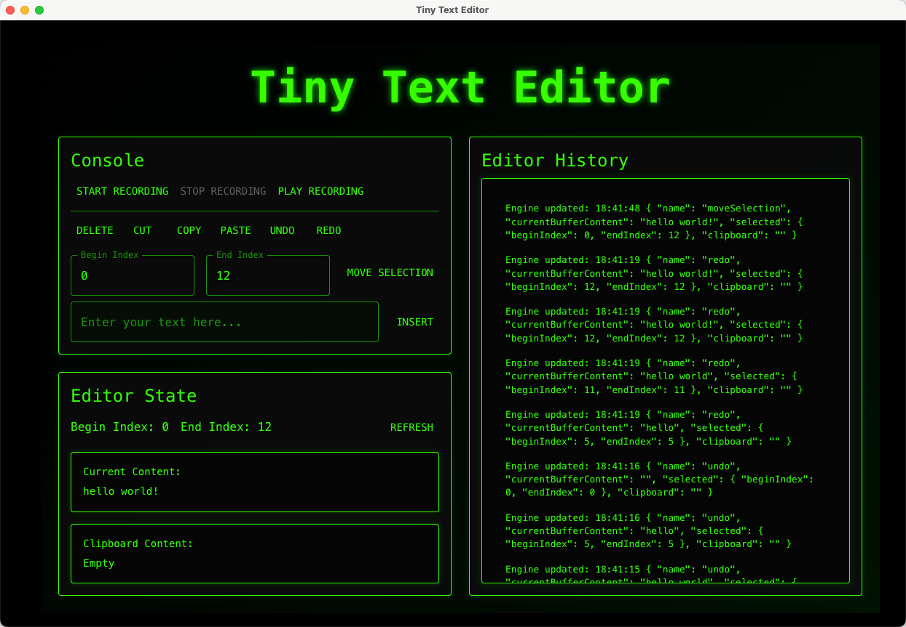

# **Architecture**

The architecture of the **Text Editor** is implemented with a modular architecture, utilizing the Command and Memento design patterns.  
It is built in a modular way. The frontend handles user interaction and communicates with the backend through the REST API. The backend, written in Java, handles the core logic and state management, while the REST API serves as the interface for communication between the frontend and backend.

This section explains the overall architectural structure of the application, explaining the key components, their interactions, and the design pattern implementations used to ensure maintainability, scalability, and performance.

Click here to go back to the [README](../README.md).

## **Table of Contents**

1. [Frontend](#frontend)
    - [Component Structure](#component-structure)
        - [Main Components](#main-components)
        - [State Management](#state-management)
        - [Event Handlers](#event-handlers)
    - [Service Intergration](#service-integration)
    - [Styling](#styling)
    - [Layout](#layout)
    - [Dependencies](#dependencies)
2. [Backend](#backend)
    - [Components](#components)
        - [Engine](#engine)
        - [Invoker](#invoker)
        - [Selection](#selection)
        - [Command](#command)
        - [Memento](#memento)
        - [Configuration](#configuration)
    - [Controller Layer](#controller-layer)
        - [EditorController](#EditorController)
3. [Component relationships](#component-relationships)

---
# Frontend

## Overview
The front-end of `Tiny Text Editor` is a text editor application based on Electron and React, designed to provide users with basic text manipulation functions, including insert, delete, copy, paste, cut, undo and redo operations. Additionally, it supports recording and replaying user actions. The UI is styled using Material-UI components and custom themes.

## Component Structure

### Main Components
- **ThemeProvider**: Applies the custom hacker theme (`hackerTheme`) to the entire application.
- **CssBaseline**: Ensures consistent baseline styles across different browsers.
- **Container**: Provides a responsive fixed-width container for the layout.
- **Box**: A flexible layout component used to structure the page.
- **Typography**: Used for displaying headings and text content.
- **TextField**: Input fields for user interaction.
- **Button**: Action buttons for various operations.
- **Paper**: Container for sections of the UI, providing elevation and padding.
- **Grid2**: Layout grid system to arrange elements in rows and columns.
- **List & ListItem**: Used to display the editor history log.

### State Management
The `TextEditor` component manages its state using React's `useState` hook:
- **inputText**: Holds the text entered by the user to be inserted into the editor.
- **outputText**: Displays the current content of the editor.
- **clipboardContent**: Stores the content copied to the clipboard.
- **history**: Logs of editor actions.
- **isRecording**: Tracks whether the editor is currently recording user actions.
- **beginIndex & endIndex**: Indices for selection range.
- **beginIndexError & endIndexError**: Flags to indicate errors in index input.
- **currentBeginIndex & currentEndIndex**: Current selection indices.

### Event Handlers
Event handlers are defined to manage user interactions:
- **handleBeginIndexChange & handleEndIndexChange**: Validate and update the selection indices.
- **updateStatus**: Updates the editor state based on the result from service calls.
- **handleRefresh**: Moves the selection to the end of the text.
- **handleInsert**: Inserts the input text at the current cursor position.
- **handleDelete**: Deletes the selected text.
- **handleMoveSelection**: Moves the selection to specified indices.
- **handleCopy, handlePaste, handleCut**: Perform clipboard operations.
- **handleStartRecord, handleStopRecord, handleReplayRecord**: Manage recording and replaying user actions.
- **handleUndo & handleRedo**: Undo or redo the last action.

## Service Integration
The `TextEditor` component interacts with the `editor-service` module to perform core editing operations such as:
- **copy, cut, deleteText, insertText, moveSelection, paste, redo, replayRecord, startRecord, stopRecord, undo**

## Styling
The application uses Material-UI's `ThemeProvider` to apply a custom theme (`hackerTheme`). The theme defines colors, typography, and other visual properties. Specific styles are applied to individual components to achieve the desired look and feel.

## Layout
The layout is divided into three main sections:
1. **Console Section**:
    - Buttons for starting/stopping recording, playing back recorded actions, and performing text manipulations.
    - Input fields for specifying selection indices and inserting new text.

2. **Editor State Section**:
    - Displays the current selection indices and provides a refresh button.
    - Shows the current content of the editor and the clipboard content.

3. **Editor History Section**:
    - Logs all editor actions in a scrollable list.

## Dependencies
- **React**: For building the UI components.
- **Material-UI**: For styling and layout components.
- **Axios**: Provides the core functionality for text manipulation and recording using Axios to communicate with the backend.
- **Electron**: For building cross-platform desktop applications using web technologies.

## **Backend**
## **Components**

### **Engine**

The **Engine** is responsible for managing the buffer (which is basically the entire text in the editor), and clipboard operations. It interacts with **SelectionImpl** class via **Selection** interface to handle all the operations related to selection. It is the heart of the text editor, handling the core logic for editing text.

- **Interface**: `Engine`
    - Defines the methods needed for the engine of a simple text editor.

- **Class**: `EngineImpl`
    - Implements the `Engine` interface to interact with the engine state.
    - Manages the **text buffer**, where the main text is stored.
    - Handles **clipboard operations**, such as copy, cut, paste and delete.
    - Maintains an instance of **Selection**, the currently selected portion of the text in the buffer.
    - Supports operations like `insert`, `delete`, `copySelectedText`, `cutSelectedText`, and `pasteClipboard`.
    - In v3, it is used as an originator for the Memento design pattern. And is used to save and when needed, restore, a snapshot of an engine state. This is part of the implementation for the redo and undo operations.

### **Invoker**
- **Class**: `Invoker`
    - Responsible for invoking commands, decoupling the actual execution of commands from the application logic.
    - Part of the command design pattern implementation.
    - It is able to execute commands and add new commands.

### **Selection**
The **Selection** component has information about the start and end indices of the selected text. It is used to manage the selection of text in the editor.
This component interacts with `EngineImpl` to perform operations on the selected text.

- **Interface**: `Selection`
    - Abstracts the concept of selecting text with methods to get and set selection indices.

- **Class**: `SelectionImpl`
    - Implements the `Selection` interface to manage the start (`beginIndex`) and end (`endIndex`) of the selection.

### **Command**

The **Command** class is part of command pattern and is used to encapsulate the implementation of all the commands of the system from the invoker. All the commands are essentially converted to concrete command classes where they all have a single function **execute()**. This decouples the request for an operation from its actual execution.

- **Interface**: `Command`
    - Defines a common interface for all commands with a method `execute()`.
- **Interface**: `Originator`
    - Defines the methods needed for the originator of the Memento design pattern.
    - It is used to save and restore the state of the engine.
    - Contains the functions `generateMemento()` and `restoreFromMemento(memento m)`.
    - It is useful for Recording functionality and undo/redo operations.
-- **Interface** CommandOriginator
    - Extends the interfaces Command and Originator.
- **Class**: `AbstractConcreteCommand`
    - Abstract class that provides the engine instance to all the classes that implement it.
    - It is used to as a common class for all the concrete command classes.
    - It has an instance of the engine class and provides access to that object via inheritance. 

- **Concrete Command Classes**:
  - **`Selection`**: Updates the selection indices based on user input.
  - **`Deletion`**: Removes the selected text from the buffer.
  - **`Copy`**: Copies the selected text to the clipboard.
  - **`Cut`**: Copies the selected text to the clipboard and removes it from the text buffer.
  - **`Paste`**: Pastes the clipboard content at the current selection.
  - **`Insertion`**: Inserts new text at the current selection.

### **Memento**

The **Memento** pattern enables recording, and replaying that recording. Furthermore, undo and redo functionality by capturing and storing snapshots of the engine are implemented using the Memento pattern.
- **Interface** `Memento`
    - Defines the methods needed for the memento of the Memento design pattern.
    - It is useful for Recording functionality and undo/redo operations.
- **Class** `InsertMemento`
    - Implements the `Memento` interface to store the state of the engine when an insertion operation is performed.
    - Contains the text inserted and the indices where it was inserted.
    - Used to restore the engine state when undoing or redoing an insertion operation.
    - It is used to store the state of the engine when an insertion operation is performed.
    - It is also used to replay the recording after a recording is stopped and replayed
- **Class** `SelectMemento`
    - Implements the `Memento` interface to store the state of the engine when a selection operation is performed.
    - Contains the indices of the selection.
    - Used to restore the engine state when undoing or redoing a selection operation.
    - It is used to store the state of the engine when a selection operation is performed.
    - It is also used to replay the recording after a recording is stopped and replayed

- **Interface**: `Originator`
    - Defines the methods needed for the originator of the Memento design pattern.
    - It is used to save and restore the state of the engine.
    - Contains the functions `generateMemento()` and `restoreFromMemento(memento m)`.
    - It is useful for Recording functionality and undo/redo operations.
- **Class** `Recorder`
    - This is a caretaker class
    - It is used to store the mementos of the engine when the recording is started.
    - It is used to replay the recording after a recording is stopped and replayed
- **Class** `UndoManager`
    - This is a caretaker class
    - It is used to store the past and future states and past and future commands. 
    - Past and future states are the snapshots of the engine after 'k' number of commands and past and future commands are the commands that are executed on the engine to get to the current state.
    - It is used to undo and redo the commands and states of the engine.
    - We have used an algorithm which is both memory and processor friendly.
    - We have k as a number of commands after which we store a snapshot of the engine.
    - we store the past and future states and commands in a list and we store the snapshots of the engine in another list.
    - When from the current state we want to go to the past state we go to the snapshot of the engine and restore the engine by apply the specific number of commands to get to the state before the current state and add the previously current state to the future states and add to future commands depending on the case. The whole scenario is described in the java docs as well.
    - Similar algorithm goes for the redo operation.
    - When we redo the operation we go to the future states and restore the engine by applying the specific number of commands to get to the state after the current state and add the current state to the past states and add to past commands depending on the case. The whole scenario is described in the java docs as well.
    - If after undo a new operation like insert, delete, copy, cut, paste is performed then the future states and commands are cleared and the new operation is added to the past states and commands.

### **Configuration**
- **Class** `Configuration`
    - Configuration class for defining and initializing components of the application. 
    - This class includes command constants and dependency injection configurations.

## **Controller Layer**

The **Controller** layers act as the intermediary between the core engine and the frontend, providing a structured way to interact with the backend.

### **EditorController**

The **EditorController** is responsible for exposing the core functionality of the text editor as a RESTful API. It receives HTTP requests, delegates them to the service layer, and returns the results.

- **Class**: `EditorController`
    - Exposes a REST API for text editing operations.
    - Routes incoming requests to the appropriate methods.

## **Component relationships**

- **Engine and Selection**:
    - The `EngineImpl` depends on `SelectionImpl` to manage the selection within the text buffer, ensuring that the correct portion of the text is selected during operations like copy, cut, and paste.

- **Commands and Engine**:
    - Each command (e.g., `Copy`, `Cut`) interacts with `EngineImpl` to execute its specific task. Commands are executed through `EngineInvoker`, allowing for decoupled execution.

- **Undo/Redo Management**:
    - `Caretaker classes` manages the history of `Memento` objects, allowing the application to navigate through previous states for recording, undo and redo operations.
    - `Originator` creates and restores mementos based on the current state of `EngineImpl`.

- **REST API**:
    - `EngineController` communicates with `Invoker` to execute commands.

  
    